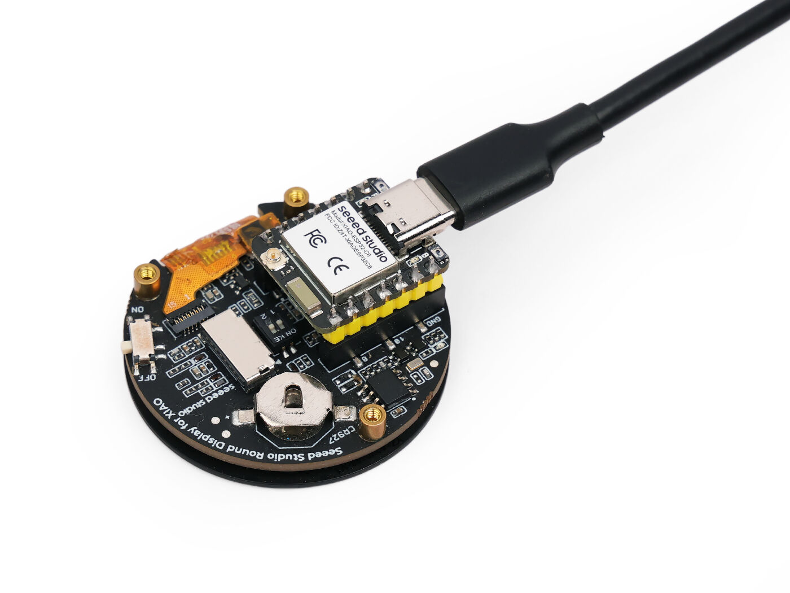
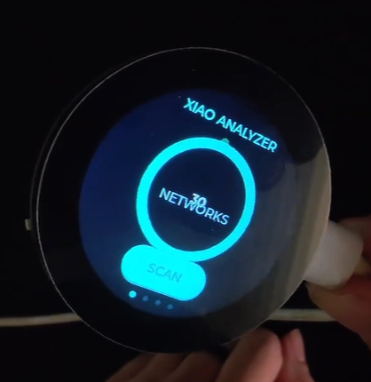
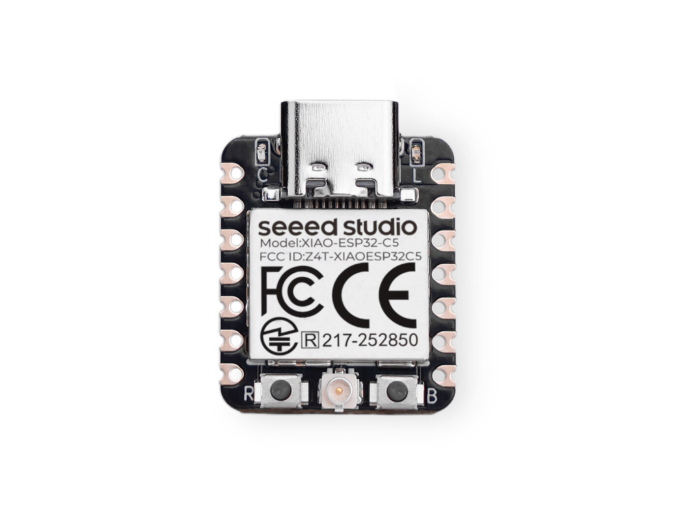
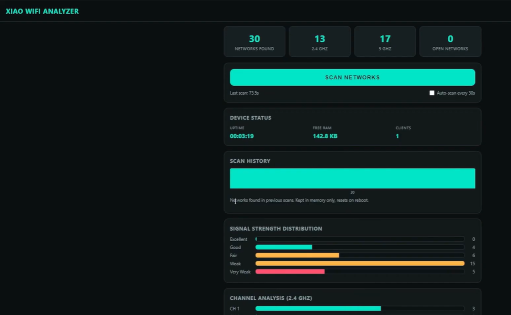

# XIAO WiFi Analyzer

**Analizador Wi-Fi portátil, autónomo y educativo**, construido sobre la [Seeed Studio XIAO ESP32-C5](https://wiki.seeedstudio.com/xiao_esp32c5_getting_started/). Crea su propio punto de acceso Wi-Fi, escanea el entorno 2.4GHz/5GHz y muestra los resultados en un dashboard web en tiempo real — sin necesitar router, sin internet, sin Raspberry Pi y sin ordenador conectado una vez cargado el firmware.

Existen **dos versiones** del firmware en este repositorio:

| Versión | Qué añade | Carpeta |
|---|---|---|
| 🟢 **Básica** | AP + escáner + servidor web + dashboard completo (recomendada para empezar) | [`firmware/XIAO_WiFi_Analyzer_Basico`](firmware/XIAO_WiFi_Analyzer_Basico) |
| 🔵 **Con pantalla** | Todo lo anterior + [Round Display for XIAO](https://wiki.seeedstudio.com/get_start_round_display/) (1.28", táctil), con 4 pantallas navegables por swipe | [`firmware/XIAO_WiFi_Analyzer_Pantalla`](firmware/XIAO_WiFi_Analyzer_Pantalla) |

> ⚠️ **Empieza siempre por la versión básica.** Es más simple de compilar (cero librerías de terceros) y te confirma que tu placa, tu entorno y tu antena funcionan bien antes de meterte con la pantalla, que tiene bastantes más piezas móviles.

---

## 🛒 Dónde comprar el hardware

| Componente | Enlace |
|---|---|
| Seeed Studio XIAO ESP32-C5 | [Comprar en Seeed Studio](https://www.seeedstudio.com/Seeed-Studio-XIAO-ESP32C5-p-6609.html?sensecap_affiliate=w2q4ssn) |
| Round Touch Display for XIAO (1.28") | [Comprar en Seeed Studio](https://www.seeedstudio.com/1-28-Round-Touch-Display-for-Seeed-Studio-XIAO-ESP32.html?sensecap_affiliate=w2q4ssn) |

> Estos son enlaces de afiliado — comprar a través de ellos no te cuesta nada extra y ayuda a mantener este proyecto y el canal. Si prefieres no usarlos, busca los mismos productos directamente en [seeedstudio.com](https://www.seeedstudio.com).

---

## 📸 Galería

  
  

  
  
  

---

## Índice de la documentación

1. **[Requisitos de hardware](docs/01-requisitos-hardware.md)** — qué comprar, antena, pines, alimentación.
2. **[Instalación del entorno](docs/02-instalacion-entorno.md)** — Arduino IDE, paquete de placas, versiones exactas.
3. **[Guía: versión básica](docs/03-guia-version-basica.md)** — compilar, cargar y probar el analizador sin pantalla.
4. **[Guía: versión con pantalla](docs/04-guia-version-pantalla.md)** — todas las librerías de Seeed, enlaces de descarga, configuración paso a paso.
5. **[Solución de problemas](docs/05-solucion-problemas.md)** — todos los errores reales que nos encontramos, con la causa exacta y el arreglo.
6. **[Referencia de la API REST](docs/06-referencia-api.md)** — todos los endpoints del dashboard, documentados.
7. **[Pines y hardware interno](docs/07-pines-y-hardware.md)** — mapeo completo de pines XIAO ESP32-C5 ↔ Round Display.

---

## Capturas rápidas de lo que hace

- **Punto de acceso propio**: `XIAO-WIFI-ANALYZER`, IP fija `192.168.4.1`, captive portal opcional.
- **Escaneo asíncrono** con barra de progreso real (no bloquea el resto del firmware).
- **Dashboard completo**: redes por banda (2.4/5GHz), distribución de calidad de señal, análisis de canales con recomendación, análisis de seguridad (WPA3/WPA2/WPA/WEP/abiertas), historial de escaneos, estado del dispositivo (RAM libre, uptime, clientes conectados), buscador y ordenación de redes, estimación de distancia por RSSI.
- **(Versión con pantalla)** 4 pantallas físicas navegables por gesto: Home (medidor circular animado + botón de escaneo), lista de redes, análisis de canales, estado del dispositivo.

## Alcance ético — léelo antes de usarlo

Este proyecto es **exclusivamente pasivo y educativo**. Se limita a mostrar información que cualquier red Wi-Fi anuncia públicamente (SSID, canal, tipo de cifrado anunciado, potencia de señal recibida). **No** realiza ni implementa:

- Deauth / disassociation attacks
- Evil twin / puntos de acceso falsos
- Captura o intercepción de tráfico ajeno
- Fuerza bruta ni explotación de vulnerabilidades
- Jamming ni interferencia deliberada

Úsalo únicamente en redes propias o en entornos donde tengas autorización explícita para analizar el espectro Wi-Fi.

## Placa validada

Todo este repositorio está probado sobre una **Seeed Studio XIAO ESP32-C5** física real (no es un proyecto teórico). Cada paso de instalación, cada versión de librería y cada solución de la guía de problemas viene de errores reales encontrados y resueltos durante el desarrollo — no de documentación genérica copiada.

## Licencia

Ver [`LICENSE`](LICENSE) (MIT). El hardware de terceros mencionado (XIAO ESP32-C5, Round Display) es propiedad de Seeed Studio; este repositorio solo contiene firmware propio.

## Créditos

- [Seeed Studio](https://www.seeedstudio.com/) — fabricante de la XIAO ESP32-C5 y la Round Display, y de las librerías `Seeed_GFX` / `Seeed_Arduino_RoundDisplay`.
- [LVGL](https://lvgl.io/) — motor gráfico usado en la versión con pantalla.
